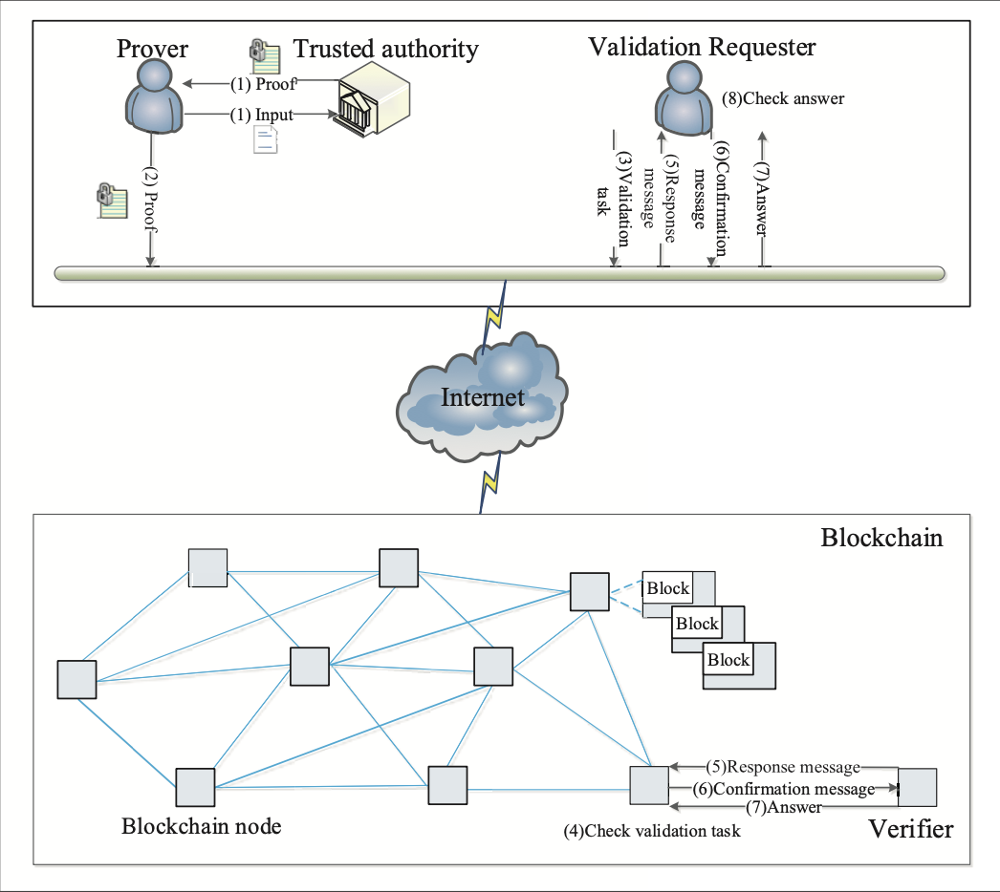

# 计算理论大作业草稿
这只是为了方便论文写作时合作和版本控制而建立的仓库，最终版论文可能并不会直接以md格式生成。
## 注意事项
1. **图片**  
    图片统一放在 `./asset` 下，以内容命名。插入格式为 `` . 如  

2. **引用**  
    引用的文献暂时以 `[id]: link_or_apa` 格式放在 **参考文献** 一章，正文中以 `[exp][id]` 格式引用。 如这里[an example][id] 

[id]: http://example.com/  "Optional Title Here"

3. **参考资料**  
    参考资料放在 `./materials` 文件夹中。

4. 关于为什么使用git  
   用git一是为了版本控制，方便在修改到未来某一版的时候需要过去不小心删除的东西。二是为了方便协作，可以同步进度，看到别人写的东西，也可以对应地调整自己的内容。避免各写各的最后合起来一团糟的局面。先用md写也是基于差不多的考虑。所以大家每次修改完后最好记得commit了push一下，看到远程有修改可以pull一下。